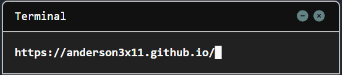

🔴🟡🟢

 

  

  
  &nbsp;
  

# 🔐 Cybersecurity Enthusiast 
🌱 Currently learning Cybersecurity. 🔍 Exploring CTFs, challenges, and security concepts. 🎯 Focused on penetration testing, reverse engineering, and web security. 🎮 Enjoys hacking challenges, bug bounty, and CTF competitions. 🛠️ Burp Suite, Wireshark, Gobuster, Nmap, and more.  💡 Always curious, always learning.

# 💻 Tech Stack:
                   

# 📚 Portfolio:

# 📊 GitHub Stats:

## 🏆 GitHub Trophies

---