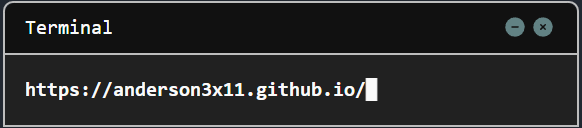

🔴🟡🟢
<h1 align="center"><samp>Hi 👋 I'm Anderson</samp></h1>
 

  

  
  &nbsp;
  

<h1 align="center"><samp>🔐 Profile</samp></h1>
🌱 Currently learning Cybersecurity. 🔍 Exploring CTFs, challenges, and security concepts. 🎯 Focused on penetration testing, reverse engineering, and web security. 🎮 Enjoys hacking challenges, bug bounty, and CTF competitions. 🛠️ Burp Suite, Wireshark, Gobuster, Nmap, and more.  💡 Always curious, always learning.

<!-- Languages -->
<h1 align="center"><samp>💻 Languages and Tools</samp></h1>

<table align="center">
  <tr>
    <td align="center" width="100">
        
       C#
    </td>
    <td align="center" width="100">
        
       C++
    </td>
    <td align="center" width="100">
        
       Go
    </td>
    <td align="center" width="100">
        
       PHP
    </td>
    <td align="center" width="100">
        
       Symfony
    </td>
    <td align="center" width="100">
        
       SQLite
    </td>
    <td align="center" width="100">
        
       MySQL
    </td>
  </tr>
  <tr>
    <td align="center" width="100">
        
       Bash
    </td>
    <td align="center" width="100">
        
       JavaScript
    </td>
    <td align="center" width="100">
        
       HTML5
    </td>
    <td align="center" width="100">
        
       CSS
    </td>
    <td align="center" width="100">
        
       Arch
    </td>
    <td align="center" width="100">
        
       Nodejs
    </td>
    <td align="center" width="100">
        
       Python
    </td>
  </tr>
  <tr>
    <td align="center" width="100"> 
        
       Git
    </td>
    <td align="center" width="100">
        
       Github
    </td>
    <td align="center" width="100">
        
       Docker
    </td>
    <td align="center" width="100">
        
       VsCode
    </td>
    <td align="center" width="100">
        
       Linux
    </td>
    <td align="center" width="100">
        
       Apple
    </td>
    <td align="center" width="100">
        
       Windows
    </td>
  </tr>
</table>

<h1><samp>📚 Portfolio</samp></h1>

<h1 align="center"><samp>📊 GitHub Stats</samp></h1>

 

